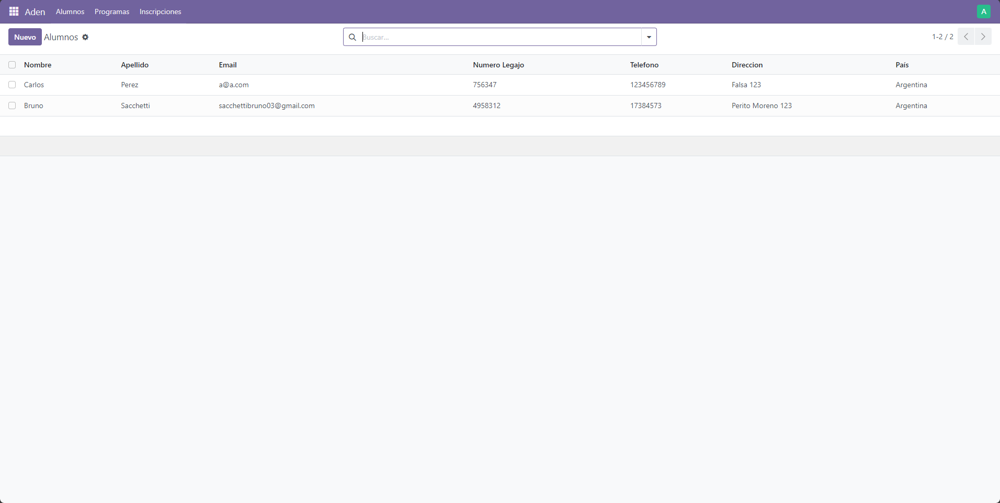
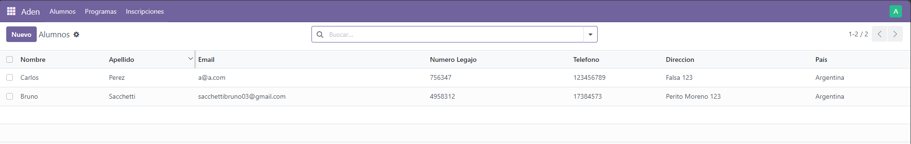
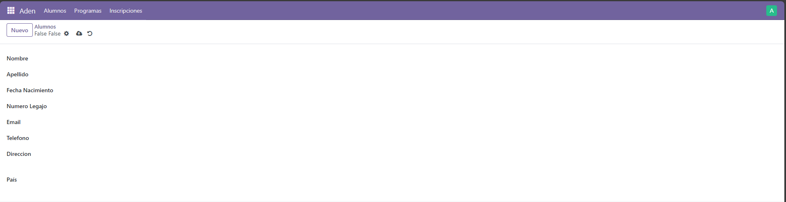
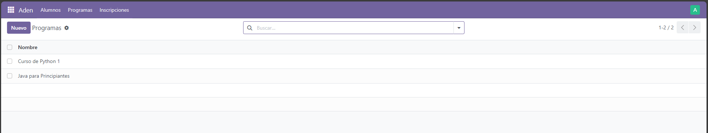
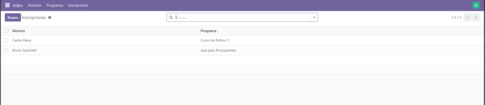
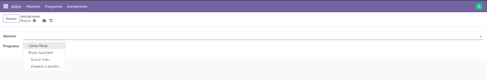
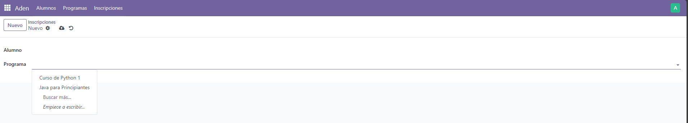
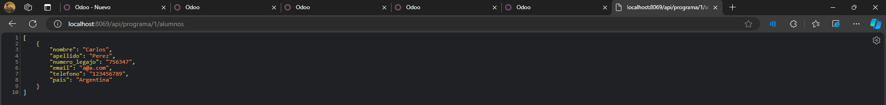

# Aden - Prueba Técnica Odoo
**Autor:** Bruno Sacchetti  
**Posición:** Desarrollador Backend Jr.  
**Tecnología:**
    - Odoo 17 (Python)
    - IDE: PyCharm  
    - Base de Datos: PostgreSQL
------------------------------------------

## 🧩 Descripción

Este módulo personalizado de Odoo permite gestionar:

- Alumnos (`aden.alumno`)
- Programas de estudio (`aden.programa`)
- Inscripciones de alumnos a programas (`aden.inscripcion`)

Incluye también una API REST para obtener los alumnos inscriptos en un programa específico.

GET /api/programa/<programa_id>/alumnos

Ejemplo de respuesta en formato JSON: 
    [
        {
            "nombre": "Bruno",
            "apellido": "Sacchetti",
            "numero_legajo": "4958312",
            "email": "sacchettibruno03@gmail.com",
            "telefono": "17384573",
            "pais": "Argentina"
        }
    ]

------------------------------------------

## 📦 Requisitos

- Python 3.12  
- Odoo 17 instalado (modo desarrollador)  
- PostgreSQL funcionando  
- Entorno virtual con dependencias instaladas (`pip install -r requirements.txt`)

------------------------------------------

## ⚙️ Instalación

1. Clonar este repositorio en tu carpeta de addons personalizados:

   git clone https://github.com/tu-usuario/aden-odoo.git

2. Agregar al path el custom addons que hicimos, en odoo.conf, dentro del server local de Odoo

   addons_path = C:\Program Files\Odoo 17\server\odoo\addons,C:\odoo_custom_addons

3. Reiniciar el servidor y actualizar la lista de módulos:

   python odoo-bin -c odoo.conf -u prueba_tecnica

4. Instalar el módulo desde el frontend de Odoo → Aplicaciones → Aden Prueba Técnica

## 🖥️ Capturas del módulo

### Modulo Visible

### Modulo Instalado 

### Menú principal

### Menú Alumnos

### Vista de formulario de Alumno

### Menú Programa

### Vista de formulario de Programas

### Menú Inscripción

### Vista de formulario de Inscripciones

### Resultado del endpoint API

